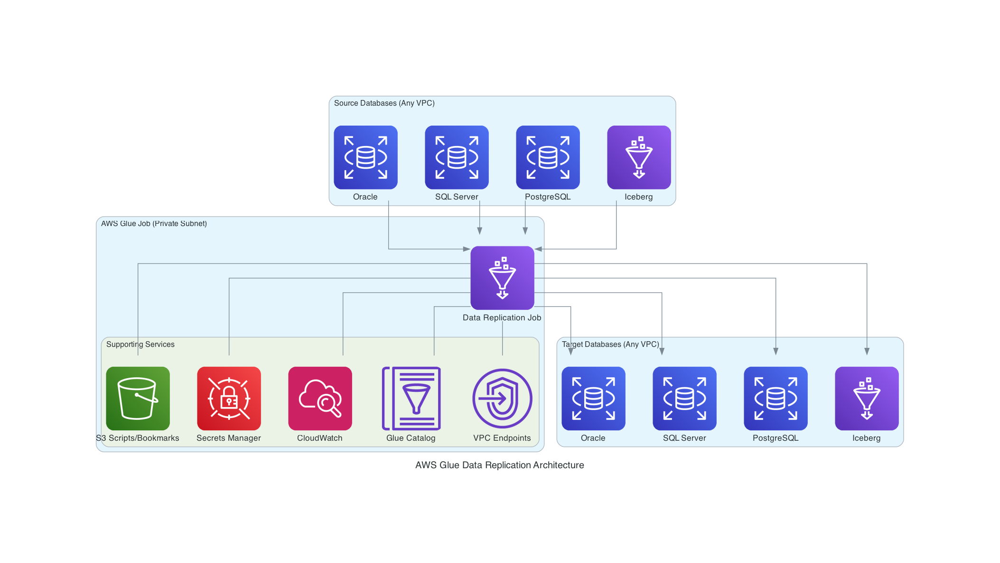

# AWS Glue Data Replication

A comprehensive AWS Glue-based data replication solution that supports full-load and incremental data migration across multiple database types with cross-VPC network connectivity.

## Features

- **Multi-Database Support**: Oracle, SQL Server, PostgreSQL, DB2, Apache Iceberg
- **AWS Glue Connection Support**: Create new or use existing AWS Glue Connections with centralized credential management
- **Cross-VPC Connectivity**: Secure database access across different VPCs using VPC endpoints
- **Incremental Processing**: Automatic incremental column detection with Glue job bookmarks
- **Parallel Processing**: Partitioned JDBC reads and automatic write parallelization for large datasets
- **Comprehensive Monitoring**: CloudWatch metrics, dashboards, and alarms
- **Error Handling**: Robust error recovery with table-level isolation
- **Modular Architecture**: Clean separation of concerns for maintainability
- **Dual Deployment**: Deploy via CloudFormation or Terraform with a unified parameter format

## Architecture



The solution connects source databases (Oracle, SQL Server, PostgreSQL, DB2, Iceberg) to target databases through an AWS Glue job running in a private subnet. The job integrates with S3 for scripts and bookmarks, Secrets Manager for credentials, CloudWatch for monitoring, and the Glue Data Catalog for Iceberg tables. VPC endpoints enable secure connectivity in private subnets.

## Supported Databases

| Database | Engine Type | Notes |
|----------|-------------|-------|
| Oracle | `oracle` | JDBC connection with Oracle driver |
| SQL Server | `sqlserver` | JDBC connection with Microsoft driver |
| PostgreSQL | `postgresql` | JDBC connection with PostgreSQL driver |
| IBM DB2 | `db2` | JDBC connection with IBM driver |
| Apache Iceberg | `iceberg` | Uses Glue Data Catalog and Spark |

## Quick Start

### Prerequisites

- AWS CLI configured with appropriate permissions
- S3 bucket for hosting templates and scripts
- Database connection details
- VPC configuration (for cross-VPC setup)

### Deploy

#### Option A: CloudFormation (Default)

```bash
# Clone repository
git clone <repository-url>
cd glue-data-replication

# Configure parameters
cp examples/sqlserver-to-sqlserver-parameters.tfvars.json my-parameters.tfvars.json
# Edit my-parameters.tfvars.json with your values

# Deploy via CloudFormation (default)
./deploy.sh -s my-glue-replication -b my-bucket-name -p my-parameters.tfvars.json

# Run job
aws glue start-job-run --job-name my-job-name
```

#### Option B: Terraform

```bash
# Deploy via Terraform
./deploy.sh -b my-bucket-name -p my-parameters.tfvars.json --type terraform
```

> **Note**: Replace placeholder values like `my-bucket-name` with your actual AWS resource names. The deploy script auto-detects the parameter file format and converts as needed.

For detailed setup instructions, see the [Quick Start Guide](docs/QUICK_START_GUIDE.md).

## Project Structure

```
aws-glue-data-replication/
├── src/glue_job/           # Glue job modules (config, database, storage, monitoring, network)
├── infrastructure/
│   ├── cloudformation/     # CloudFormation template
│   ├── terraform/          # Terraform module (variables.tf, main.tf, outputs.tf)
│   ├── iam/                # IAM policies
│   └── scripts/            # Deployment and packaging scripts
├── docs/                   # Documentation
├── examples/               # Parameter file examples (.tfvars.json)
├── tests/                  # Test suites
└── infrastructure/          # CloudFormation, Terraform, IAM, scripts, config
```

## Documentation

### Getting Started
- [Quick Start Guide](docs/QUICK_START_GUIDE.md) - Step-by-step setup walkthrough
- [Deployment Guide](docs/DEPLOYMENT_GUIDE.md) - CloudFormation deployment instructions
- [Terraform Deployment Guide](docs/TERRAFORM_DEPLOYMENT_GUIDE.md) - Terraform deployment instructions
- [Parameter Reference](docs/PARAMETER_REFERENCE.md) - Parameter documentation for both deployment methods

### Configuration
- [Database Configuration Guide](docs/DATABASE_CONFIGURATION_GUIDE.md) - Database-specific setup
- [Network Configuration Guide](docs/NETWORK_CONFIGURATION_GUIDE.md) - VPC and networking
- [Iceberg Usage Guide](docs/ICEBERG_USAGE_GUIDE.md) - Apache Iceberg configuration
- [Bookmark Details](docs/BOOKMARK_DETAILS.md) - Incremental loading strategies
- [Configuration Examples](docs/PARAMETER_REFERENCE.md#configuration-examples) - Example parameter files

### Operations
- [Observability Guide](docs/OBSERVABILITY_GUIDE.md) - Monitoring and alerting
- [Progress Tracking Guide](docs/PROGRESS_TRACKING_GUIDE.md) - Real-time progress monitoring
- [Error Handling Guide](docs/ERROR_HANDLING_GUIDE.md) - Error recovery patterns
- [Glue Connections Troubleshooting](docs/GLUE_CONNECTIONS_TROUBLESHOOTING_GUIDE.md) - Connection issues

### Development
- [Architecture Guide](docs/ARCHITECTURE.md) - Technical design decisions
- [API Reference](docs/API_REFERENCE.md) - Module interfaces
- [Testing Guide](docs/TESTING_GUIDE.md) - Testing procedures
- [DevOps Deployment Guide](docs/DEVOPS_DEPLOYMENT_GUIDE.md) - CI/CD automation

## Key Capabilities

### Connection Strategies

The solution supports three connection strategies for JDBC databases:

1. **Create New Glue Connections** - Automatically create connections with Secrets Manager integration
2. **Use Existing Glue Connections** - Leverage pre-configured connections
3. **Direct JDBC Connections** - Traditional direct database connections

### Network Options

| Configuration | VPC Endpoints Required |
|---------------|----------------------|
| Same VPC | None |
| Cross-VPC | Glue VPC endpoint |
| Private Subnets | Glue + S3 VPC endpoints |

### Worker Types

| Type | vCPU | Memory | Use Case |
|------|------|--------|----------|
| G.025X | 2 | 4 GB | Light workloads |
| G.1X | 4 | 16 GB | Standard workloads |
| G.2X | 8 | 32 GB | Memory-intensive |

## Contributing

1. Fork the repository
2. Create a feature branch
3. Make your changes
4. Test thoroughly
5. Submit a pull request

## License

This project is licensed under the MIT License - see the LICENSE file for details.

---

<p align="center">
  Implemented using
  <a href="https://kiro.dev">
    
  </a>
</p>
