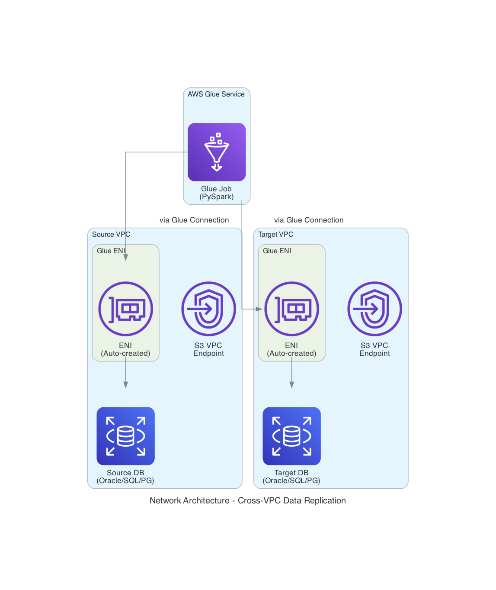

# Network Configuration Guide

This guide provides comprehensive information about configuring network connectivity for the AWS Glue Data Replication system across different VPC scenarios.

## Overview

The AWS Glue Data Replication system supports flexible network configurations to accommodate databases located in different VPCs or network environments. This capability is essential for enterprise environments where databases are isolated in separate VPCs for security, compliance, or organizational reasons.

## Network Architecture

### Components

The network connectivity solution consists of several AWS components:

1. **AWS Glue Connections**: Enable cross-VPC database access
2. **Elastic Network Interfaces (ENIs)**: Provide network connectivity in target VPCs
3. **Security Groups**: Control network access to databases
4. **VPC Endpoints**: Enable private S3 access for JDBC drivers
5. **Route Tables**: Direct traffic between VPCs and services

### Network Flow Diagram



*The diagram shows how AWS Glue connects to databases in different VPCs using Glue Connections and auto-created ENIs, with optional S3 VPC endpoints for private subnet access.*

## Supported Network Scenarios

### Scenario 1: Same VPC (Default)

**Description**: Both source and target databases are in the same VPC as the Glue job execution environment.

**Configuration**: No additional network parameters required.

**Use Cases**:
- Development and testing environments
- Simple migrations within the same VPC
- RDS instances in the default VPC

**Example**:
```json
{
  "JobName": "same-vpc-migration",
  "SourceEngineType": "oracle",
  "TargetEngineType": "postgresql"
  // No network parameters needed
}
```

**Network Flow**:
```
Glue Job ──────► Source DB (Same VPC)
    │
    └──────────► Target DB (Same VPC)
```

### Scenario 2: Cross-VPC Source

**Description**: Source database is in a different VPC, target database is in the same VPC as Glue.

**Configuration**: Source network parameters required.

**Use Cases**:
- Migrating from legacy VPC to new VPC
- Consolidating data from isolated source systems
- Cross-account database access

**Required Parameters**:
- `SourceVpcId`: VPC ID of the source database
- `SourceSubnetIds`: Subnets where Glue can create ENIs
- `SourceSecurityGroupIds`: Security groups for database access
- `CreateSourceS3VpcEndpoint`: YES if source is in private subnet

**Example**:
```json
{
  "JobName": "cross-vpc-source-migration",
  "SourceVpcId": "vpc-source123",
  "SourceSubnetIds": "subnet-src1,subnet-src2",
  "SourceSecurityGroupIds": "sg-source123",
  "CreateSourceS3VpcEndpoint": "YES"
}
```

**Network Flow**:
```
Glue Job ──────► Source DB (Different VPC via Glue Connection)
    │
    └──────────► Target DB (Same VPC)
```

### Scenario 3: Cross-VPC Target

**Description**: Target database is in a different VPC, source database is in the same VPC as Glue.

**Configuration**: Target network parameters required.

**Use Cases**:
- Loading data into isolated analytics VPC
- Writing to production databases in separate VPC
- Cross-account data delivery

**Required Parameters**:
- `TargetVpcId`: VPC ID of the target database
- `TargetSubnetIds`: Subnets where Glue can create ENIs
- `TargetSecurityGroupIds`: Security groups for database access
- `CreateTargetS3VpcEndpoint`: YES if target is in private subnet

**Example**:
```json
{
  "JobName": "cross-vpc-target-migration",
  "TargetVpcId": "vpc-target456",
  "TargetSubnetIds": "subnet-tgt1,subnet-tgt2",
  "TargetSecurityGroupIds": "sg-target456",
  "CreateTargetS3VpcEndpoint": "NO"
}
```

**Network Flow**:
```
Glue Job ──────► Source DB (Same VPC)
    │
    └──────────► Target DB (Different VPC via Glue Connection)
```

### Scenario 4: Cross-VPC Both

**Description**: Both source and target databases are in different VPCs from each other and from Glue.

**Configuration**: Both source and target network parameters required.

**Use Cases**:
- Complex enterprise environments
- Cross-account migrations
- Hub-and-spoke network architectures

**Required Parameters**:
- All source network parameters
- All target network parameters

**Example**:
```json
{
  "JobName": "cross-vpc-both-migration",
  "SourceVpcId": "vpc-source123",
  "SourceSubnetIds": "subnet-src1,subnet-src2",
  "SourceSecurityGroupIds": "sg-source123",
  "CreateSourceS3VpcEndpoint": "YES",
  "TargetVpcId": "vpc-target456",
  "TargetSubnetIds": "subnet-tgt1,subnet-tgt2",
  "TargetSecurityGroupIds": "sg-target456",
  "CreateTargetS3VpcEndpoint": "YES"
}
```

**Network Flow**:
```
Glue Job ──────► Source DB (VPC A via Glue Connection)
    │
    └──────────► Target DB (VPC B via Glue Connection)
```

## VPC Endpoint Configuration

### When to Create S3 VPC Endpoints

S3 VPC endpoints are required when databases are located in private subnets without internet gateway access. The Glue job needs to download JDBC drivers from S3, and without internet access, this requires a VPC endpoint.

#### Decision Matrix

| Subnet Type | Internet Access | S3 VPC Endpoint Needed | Parameter Value |
|-------------|----------------|----------------------|-----------------|
| Public | Via Internet Gateway | No | `NO` (default) |
| Private | Via NAT Gateway | No | `NO` (default) |
| Private | No Internet Access | Yes | `YES` |
| Private | Existing S3 VPC Endpoint | No | `NO` (default) |

#### Private vs Public Subnets

**Private Subnets**:
- No direct internet gateway route
- May have NAT gateway for outbound internet access
- Require VPC endpoints for AWS service access without internet
- More secure but require additional configuration

**Public Subnets**:
- Direct route to internet gateway
- Can access AWS services via internet
- No VPC endpoints required
- Simpler configuration but less secure

### VPC Endpoint Configuration Details

When `CreateSourceS3VpcEndpoint` or `CreateTargetS3VpcEndpoint` is set to `YES`, the system creates:

1. **Interface VPC Endpoint** (PrivateLink) for S3 service
2. **Subnet ENI placement** in the database subnets
3. **Security group association** for network access control
4. **Endpoint Policy** allowing JDBC driver access

**Endpoint Policy Example**:
```json
{
  "Version": "2012-10-17",
  "Statement": [
    {
      "Effect": "Allow",
      "Principal": "*",
      "Action": [
        "s3:GetObject",
        "s3:ListBucket"
      ],
      "Resource": [
        "arn:aws:s3:::your-jdbc-bucket/*",
        "arn:aws:s3:::your-jdbc-bucket"
      ]
    }
  ]
}
```

## Security Group Configuration

### Database Security Groups

Database security groups must allow inbound connections from Glue ENIs on the appropriate database ports.

#### Required Inbound Rules

| Database Type | Port | Protocol | Source | Description |
|---------------|------|----------|--------|-------------|
| Oracle | 1521 | TCP | Glue ENI SG | Oracle database connection |
| SQL Server | 1433 | TCP | Glue ENI SG | SQL Server database connection |
| PostgreSQL | 5432 | TCP | Glue ENI SG | PostgreSQL database connection |
| DB2 | 50000 | TCP | Glue ENI SG | DB2 database connection |

#### Security Group Rule Examples

**Oracle Database Security Group**:
```bash
aws ec2 authorize-security-group-ingress \
  --group-id sg-oracle-db \
  --protocol tcp \
  --port 1521 \
  --source-group sg-glue-eni
```

**PostgreSQL Database Security Group**:
```bash
aws ec2 authorize-security-group-ingress \
  --group-id sg-postgres-db \
  --protocol tcp \
  --port 5432 \
  --source-group sg-glue-eni
```

### Glue ENI Security Groups

Glue ENI security groups are automatically created and configured with the following rules:

#### Outbound Rules

| Port | Protocol | Destination | Purpose |
|------|----------|-------------|---------|
| Database Port | TCP | Database SG | Database connection |
| 443 | TCP | 0.0.0.0/0 | HTTPS (S3 API calls) |
| 53 | UDP | 0.0.0.0/0 | DNS resolution |

## Network Troubleshooting

### Common Issues and Solutions

#### 1. Connection Timeout Errors

**Symptoms**:
```
ERROR: Connection timed out connecting to database
```

**Diagnosis Steps**:
1. Verify VPC and subnet configuration
2. Check security group rules
3. Test connectivity from EC2 instance in same subnet
4. Verify route table configuration

**Solutions**:
```bash
# Test database connectivity
telnet database-host 1521

# Check security group rules
aws ec2 describe-security-groups --group-ids sg-12345678

# Verify route tables
aws ec2 describe-route-tables --filters "Name=association.subnet-id,Values=subnet-12345678"

# Check VPC peering or transit gateway routes
aws ec2 describe-vpc-peering-connections
```

#### 2. JDBC Driver Download Failures

**Symptoms**:
```
ERROR: Unable to download JDBC driver from S3
java.net.UnknownHostException: s3.amazonaws.com
```

**Diagnosis Steps**:
1. Check if database is in private subnet
2. Verify internet connectivity or VPC endpoint
3. Check S3 bucket permissions

**Solutions**:
```bash
# Create S3 Interface VPC endpoint
aws ec2 create-vpc-endpoint \
  --vpc-id vpc-12345678 \
  --vpc-endpoint-type Interface \
  --service-name com.amazonaws.us-east-1.s3 \
  --subnet-ids subnet-12345678 \
  --security-group-ids sg-12345678

# Or set parameter to create automatically
"CreateSourceS3VpcEndpoint": "YES"
```

#### 3. Security Group Access Denied

**Symptoms**:
```
ERROR: Connection refused
java.net.ConnectException: Connection refused
```

**Diagnosis Steps**:
1. Check security group inbound rules
2. Verify source security group references
3. Check network ACLs

**Solutions**:
```bash
# Add security group rule
aws ec2 authorize-security-group-ingress \
  --group-id sg-database \
  --protocol tcp \
  --port 1521 \
  --source-group sg-glue-eni

# Check existing rules
aws ec2 describe-security-groups \
  --group-ids sg-database \
  --query 'SecurityGroups[0].IpPermissions'
```

#### 4. ENI Creation Failures

**Symptoms**:
```
ERROR: Failed to create network interface in subnet
```

**Diagnosis Steps**:
1. Check available IP addresses in subnet
2. Verify service limits
3. Check subnet availability zone support

**Solutions**:
```bash
# Check available IPs
aws ec2 describe-subnets \
  --subnet-ids subnet-12345678 \
  --query 'Subnets[0].AvailableIpAddressCount'

# Check service limits
aws service-quotas get-service-quota \
  --service-code ec2 \
  --quota-code L-DF5E4CA3

# Use different subnet with more available IPs
```

#### 5. DNS Resolution Issues

**Symptoms**:
```
ERROR: Name or service not known
java.net.UnknownHostException: database-host.company.com
```

**Diagnosis Steps**:
1. Check VPC DNS settings
2. Verify Route 53 private hosted zones
3. Test DNS resolution from EC2 instance

**Solutions**:
```bash
# Enable DNS resolution in VPC
aws ec2 modify-vpc-attribute \
  --vpc-id vpc-12345678 \
  --enable-dns-resolution

# Enable DNS hostnames
aws ec2 modify-vpc-attribute \
  --vpc-id vpc-12345678 \
  --enable-dns-hostnames

# Check Route 53 private hosted zones
aws route53 list-hosted-zones-by-vpc --vpc-id vpc-12345678
```

### Diagnostic Commands

#### Network Connectivity Testing

```bash
# Test from EC2 instance in same subnet
# 1. Launch EC2 instance in target subnet
aws ec2 run-instances \
  --image-id ami-12345678 \
  --instance-type t3.micro \
  --subnet-id subnet-12345678 \
  --security-group-ids sg-12345678

# 2. Connect and test
ssh ec2-user@instance-ip
telnet database-host 1521
nslookup database-host
```

#### VPC Configuration Validation

```bash
# Check VPC configuration
aws ec2 describe-vpcs --vpc-ids vpc-12345678

# Check subnet configuration
aws ec2 describe-subnets --subnet-ids subnet-12345678

# Check route tables
aws ec2 describe-route-tables \
  --filters "Name=association.subnet-id,Values=subnet-12345678"

# Check security groups
aws ec2 describe-security-groups --group-ids sg-12345678
```

#### Glue Connection Testing

```bash
# Test Glue connection
aws glue get-connection --name source-connection

# Test connection from Glue console or CLI
aws glue get-connection --name source-connection \
  --query 'Connection.ConnectionProperties'
```

## Best Practices

### Network Design

1. **Subnet Planning**:
   - Use dedicated subnets for Glue connections
   - Ensure sufficient IP address space for ENI creation
   - Distribute subnets across multiple AZs for high availability

2. **Security Group Design**:
   - Create specific security groups for database access
   - Use security group references instead of IP ranges
   - Implement least-privilege access principles

3. **VPC Endpoint Strategy**:
   - Create VPC endpoints only when necessary
   - S3 VPC endpoints use Interface type (PrivateLink) with subnet and security group placement
   - Interface endpoints are consistent across all services (S3, Glue)

### Security

1. **Network Isolation**:
   - Use separate VPCs for different environments
   - Implement network segmentation for sensitive databases
   - Use VPC Flow Logs for network monitoring

2. **Access Control**:
   - Restrict security group rules to minimum required access
   - Use separate security groups for different database types
   - Regularly audit and review security group rules

3. **Monitoring**:
   - Enable VPC Flow Logs for network traffic analysis
   - Set up CloudWatch alarms for connection failures
   - Monitor ENI creation and deletion events

### Performance

1. **Network Optimization**:
   - Place databases and Glue in the same AZ when possible
   - Use placement groups for high-performance requirements
   - Monitor network latency and throughput

2. **Connection Management**:
   - Reuse Glue connections across multiple jobs
   - Configure appropriate connection timeouts
   - Monitor connection pool utilization

3. **Bandwidth Planning**:
   - Consider network bandwidth requirements for large data transfers
   - Use multiple parallel connections for high-throughput scenarios
   - Monitor network utilization during peak processing times

## Configuration Examples

### Complete Network Configuration Examples

#### Example 1: Enterprise Cross-VPC Setup

```json
{
  "Parameters": [
    {
      "ParameterKey": "JobName",
      "ParameterValue": "enterprise-cross-vpc-replication"
    },
    {
      "ParameterKey": "SourceEngineType",
      "ParameterValue": "oracle"
    },
    {
      "ParameterKey": "TargetEngineType",
      "ParameterValue": "postgresql"
    },
    {
      "ParameterKey": "SourceVpcId",
      "ParameterValue": "vpc-prod-oracle-123"
    },
    {
      "ParameterKey": "SourceSubnetIds",
      "ParameterValue": "subnet-prod-db-1a,subnet-prod-db-1b"
    },
    {
      "ParameterKey": "SourceSecurityGroupIds",
      "ParameterValue": "sg-oracle-glue-access"
    },
    {
      "ParameterKey": "CreateSourceS3VpcEndpoint",
      "ParameterValue": "YES"
    },
    {
      "ParameterKey": "TargetVpcId",
      "ParameterValue": "vpc-analytics-456"
    },
    {
      "ParameterKey": "TargetSubnetIds",
      "ParameterValue": "subnet-analytics-1a,subnet-analytics-1b"
    },
    {
      "ParameterKey": "TargetSecurityGroupIds",
      "ParameterValue": "sg-postgres-glue-access"
    },
    {
      "ParameterKey": "CreateTargetS3VpcEndpoint",
      "ParameterValue": "YES"
    }
  ]
}
```

#### Example 2: Hybrid Cloud Setup

```json
{
  "Parameters": [
    {
      "ParameterKey": "JobName",
      "ParameterValue": "hybrid-cloud-replication"
    },
    {
      "ParameterKey": "SourceEngineType",
      "ParameterValue": "sqlserver"
    },
    {
      "ParameterKey": "TargetEngineType",
      "ParameterValue": "postgresql"
    },
    {
      "ParameterKey": "SourceVpcId",
      "ParameterValue": "vpc-onprem-connection"
    },
    {
      "ParameterKey": "SourceSubnetIds",
      "ParameterValue": "subnet-dx-1a,subnet-dx-1b"
    },
    {
      "ParameterKey": "SourceSecurityGroupIds",
      "ParameterValue": "sg-onprem-sqlserver"
    },
    {
      "ParameterKey": "CreateSourceS3VpcEndpoint",
      "ParameterValue": "NO"
    }
  ]
}
```

### Security Group Templates

#### Database Security Group Template

```bash
#!/bin/bash
# Create security group for Oracle database
aws ec2 create-security-group \
  --group-name oracle-glue-access \
  --description "Allow Glue access to Oracle database" \
  --vpc-id vpc-12345678

# Add inbound rule for Oracle port
aws ec2 authorize-security-group-ingress \
  --group-id sg-oracle-db \
  --protocol tcp \
  --port 1521 \
  --source-group sg-glue-eni

# Add outbound rule for responses
aws ec2 authorize-security-group-egress \
  --group-id sg-oracle-db \
  --protocol tcp \
  --port 1024-65535 \
  --source-group sg-glue-eni
```

This comprehensive network configuration guide provides all the necessary information for implementing and troubleshooting network connectivity in the AWS Glue Data Replication system.