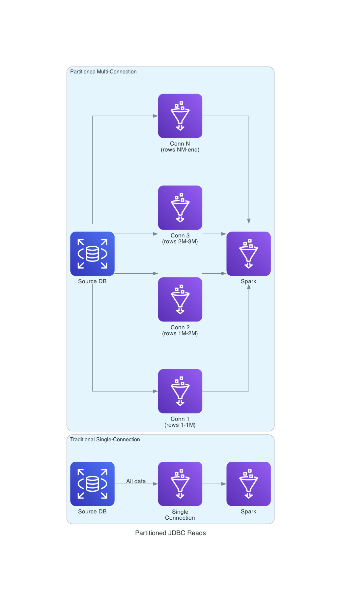

# AWS Glue Data Replication - Performance Monitoring Guide

This guide covers the comprehensive performance monitoring capabilities for large-scale data migrations, including real-time progress tracking, counting strategies, and migration phase metrics.

## Overview

The performance monitoring feature provides:

- **Real-Time Progress Tracking**: Continuous updates during data transfer operations
- **Adaptive Counting Strategies**: Optimized row counting for datasets of any size
- **Migration Phase Metrics**: Detailed metrics for read, write, and count phases
- **Load Type Differentiation**: Separate monitoring for full load and incremental load operations
- **Comprehensive CloudWatch Integration**: Metrics, dashboards, and alarms for all operations

## Counting Strategy Impact on Monitoring

With the SQL COUNT(*) optimization, the counting strategy now provides full monitoring visibility for all dataset sizes. Understanding how this works helps you make the right configuration choices.

### How Counting Strategies Work

**Immediate/Auto Counting** (`CountingStrategy=immediate` or `auto`):
1. Executes fast SQL `SELECT COUNT(*)` query on source
2. JDBC databases: Uses database statistics and indexes (server-side execution)
3. Iceberg tables: Reads from manifest metadata (no data scan)
4. Result: **Row count available in <1 second, regardless of dataset size**

**Deferred Counting** (`CountingStrategy=deferred`):
1. Writes data to target in a single pass
2. Counts rows from target after write completes (fast SQL `COUNT(*)` or Iceberg metadata)
3. Result: **Row count available only after write completes**

### Monitoring Metrics Availability by Strategy

| Metric | Immediate/Auto Counting | Deferred Counting (fallback) |
|--------|------------------------|------------------------------|
| **MigrationRowsProcessed** | ✅ Available during write | ✅ Available during write |
| **MigrationRowsPerSecond** | ✅ Available during write | ✅ Available during write |
| **MigrationProgressPercentage** | ✅ Available from start | ❌ Shows 0% until write completes |
| **ETA (Time Remaining)** | ✅ Calculated accurately | ❌ Cannot calculate until end |
| **MigrationTotalRows** | ✅ Known before write | ❌ Known only after write |
| **Final metrics** | ✅ Complete | ✅ Complete |

### SQL COUNT(*) Performance

The SQL COUNT(*) optimization provides fast row counting for all dataset sizes:

```
SQL COUNT(*) Performance (typical):
  JDBC databases (Oracle, SQL Server, PostgreSQL, DB2):
    - Uses database statistics and indexes
    - Executes server-side, only result transmitted
    - Time: <1 second for any dataset size

  Iceberg tables:
    - Reads from manifest metadata files
    - No data file scanning required
    - Time: <1 second for any dataset size
```

**Key Benefit**: Progress percentage and ETA are now available from the start for all migrations, regardless of dataset size.

### Choosing the Right Strategy

| Scenario | Recommended Strategy | Reason |
|----------|---------------------|--------|
| All migrations | `auto` (default) | SQL COUNT(*) is fast for all sizes |
| Explicit control | `immediate` | Same as auto, explicit configuration |
| SQL COUNT unavailable | `deferred` | Fallback when COUNT fails |
| Legacy compatibility | `deferred` | Maintains previous behavior |

### Dashboard Considerations

With the SQL COUNT(*) optimization, your CloudWatch dashboards will show:
- `MigrationProgressPercentage`: Accurate from start (not 0% during write)
- `MigrationRowsProcessed`: Increases throughout
- `MigrationRowsPerSecond`: Available throughout

**Note**: Deferred counting is now only used as a fallback when SQL COUNT(*) fails. In normal operation, all metrics are available from the start.

## New CloudWatch Metrics

### Migration Progress Metrics

These metrics provide real-time visibility into active migration operations.

#### MigrationRowsProcessed
**Description**: Number of rows processed during migration  
**Unit**: Count  
**Dimensions**:
- `JobName`: Name of the Glue job
- `TableName`: Name of the table being migrated
- `LoadType`: Type of load operation (`full` or `incremental`)

**Use Case**: Track progress of active migrations in real-time

#### MigrationRowsPerSecond
**Description**: Current data processing rate  
**Unit**: Count/Second  
**Dimensions**:
- `JobName`: Name of the Glue job
- `TableName`: Name of the table being migrated
- `LoadType`: Type of load operation (`full` or `incremental`)

**Use Case**: Monitor throughput and identify performance bottlenecks


#### MigrationProgressPercentage
**Description**: Progress percentage (0-100) for migrations where total rows are known  
**Unit**: Percent  
**Dimensions**:
- `JobName`: Name of the Glue job
- `TableName`: Name of the table being migrated
- `LoadType`: Type of load operation (`full` or `incremental`)

**Use Case**: Visualize completion status and estimate time remaining

#### MigrationTotalRows
**Description**: Total number of rows to be migrated (when known)  
**Unit**: Count  
**Dimensions**:
- `JobName`: Name of the Glue job
- `TableName`: Name of the table being migrated
- `LoadType`: Type of load operation (`full` or `incremental`)

**Use Case**: Understand dataset size and calculate progress percentage

### Counting Strategy Metrics

These metrics track the execution of row counting strategies.

#### CountingStrategyUsed
**Description**: Indicates which counting strategy was used  
**Unit**: Count  
**Dimensions**:
- `JobName`: Name of the Glue job
- `TableName`: Name of the table
- `StrategyType`: Type of strategy (`immediate` or `deferred`)

**Use Case**: Verify that the correct counting strategy is being applied

#### CountingDurationSeconds
**Description**: Time taken to count rows  
**Unit**: Seconds  
**Dimensions**:
- `JobName`: Name of the Glue job
- `TableName`: Name of the table
- `StrategyType`: Type of strategy (`immediate` or `deferred`)

**Use Case**: Measure counting overhead and optimize strategy selection


#### CountingRowCount
**Description**: Number of rows counted  
**Unit**: Count  
**Dimensions**:
- `JobName`: Name of the Glue job
- `TableName`: Name of the table
- `StrategyType`: Type of strategy (`immediate` or `deferred`)

**Use Case**: Validate row counts and detect discrepancies

### Migration Phase Metrics

These metrics provide detailed timing information for each phase of the migration process.

#### MigrationReadDuration
**Description**: Time spent reading data from source  
**Unit**: Seconds  
**Dimensions**:
- `JobName`: Name of the Glue job
- `TableName`: Name of the table
- `Phase`: Always `read`
- `LoadType`: Type of load operation (`full` or `incremental`)

**Use Case**: Identify source database performance issues

#### MigrationWriteDuration
**Description**: Time spent writing data to target  
**Unit**: Seconds  
**Dimensions**:
- `JobName`: Name of the Glue job
- `TableName`: Name of the table
- `Phase`: Always `write`
- `LoadType`: Type of load operation (`full` or `incremental`)

**Use Case**: Identify target database performance issues

#### MigrationCountDuration
**Description**: Time spent counting rows  
**Unit**: Seconds  
**Dimensions**:
- `JobName`: Name of the Glue job
- `TableName`: Name of the table
- `Phase`: Always `count`
- `LoadType`: Type of load operation (`full` or `incremental`)

**Use Case**: Measure counting overhead and validate strategy effectiveness


#### MigrationPhaseRowCount
**Description**: Number of rows processed in a specific phase  
**Unit**: Count  
**Dimensions**:
- `JobName`: Name of the Glue job
- `TableName`: Name of the table
- `Phase`: Phase name (`read`, `write`, or `count`)
- `LoadType`: Type of load operation (`full` or `incremental`)

**Use Case**: Validate data consistency across phases

#### MigrationStatus
**Description**: Current migration status per table  
**Unit**: None (numeric: 1=success, 0=failed, 0.5=in_progress)  
**Dimensions**:
- `JobName`: Name of the Glue job
- `TableName`: Name of the table
- `LoadType`: Type of load operation (`full` or `incremental`)

**Use Case**: Create alarms for migration failures

#### MigrationSuccess
**Description**: Successful migration completion  
**Unit**: Count  
**Dimensions**:
- `JobName`: Name of the Glue job
- `TableName`: Name of the table
- `LoadType`: Type of load operation (`full` or `incremental`)

**Use Case**: Track successful migrations and calculate success rates

#### MigrationFailed
**Description**: Failed migration  
**Unit**: Count  
**Dimensions**:
- `JobName`: Name of the Glue job
- `TableName`: Name of the table
- `LoadType`: Type of load operation (`full` or `incremental`)

**Use Case**: Track failures and trigger alerts

#### MigrationInProgress
**Description**: Migration currently in progress  
**Unit**: Count  
**Dimensions**:
- `JobName`: Name of the Glue job
- `TableName`: Name of the table
- `LoadType`: Type of load operation (`full` or `incremental`)

**Use Case**: Monitor active migrations


## CloudWatch Dashboard Template

### Dashboard JSON

Create a comprehensive dashboard to monitor migration performance:

```json
{
  "widgets": [
    {
      "type": "metric",
      "properties": {
        "metrics": [
          [ "AWS/Glue/DataReplication", "MigrationProgressPercentage", { "stat": "Average" } ]
        ],
        "view": "timeSeries",
        "stacked": false,
        "region": "us-east-1",
        "title": "Migration Progress",
        "period": 60,
        "yAxis": {
          "left": {
            "min": 0,
            "max": 100
          }
        }
      }
    },
    {
      "type": "metric",
      "properties": {
        "metrics": [
          [ "AWS/Glue/DataReplication", "MigrationRowsPerSecond", { "stat": "Average" } ]
        ],
        "view": "timeSeries",
        "stacked": false,
        "region": "us-east-1",
        "title": "Processing Throughput",
        "period": 60,
        "yAxis": {
          "left": {
            "min": 0
          }
        }
      }
    },
    {
      "type": "metric",
      "properties": {
        "metrics": [
          [ "AWS/Glue/DataReplication", "MigrationRowsProcessed", { "stat": "Sum" } ]
        ],
        "view": "timeSeries",
        "stacked": false,
        "region": "us-east-1",
        "title": "Rows Processed",
        "period": 60
      }
    },
    {
      "type": "metric",
      "properties": {
        "metrics": [
          [ "AWS/Glue/DataReplication", "CountingStrategyUsed", { "stat": "SampleCount", "label": "Immediate" }, { "StrategyType": "immediate" } ],
          [ "...", { "StrategyType": "deferred" }, { "label": "Deferred" } ]
        ],
        "view": "pie",
        "region": "us-east-1",
        "title": "Counting Strategy Distribution",
        "period": 300
      }
    },
    {
      "type": "metric",
      "properties": {
        "metrics": [
          [ "AWS/Glue/DataReplication", "MigrationReadDuration", { "stat": "Average", "label": "Read" } ],
          [ ".", "MigrationWriteDuration", { "stat": "Average", "label": "Write" } ],
          [ ".", "MigrationCountDuration", { "stat": "Average", "label": "Count" } ]
        ],
        "view": "timeSeries",
        "stacked": true,
        "region": "us-east-1",
        "title": "Migration Phase Durations",
        "period": 300
      }
    },
    {
      "type": "metric",
      "properties": {
        "metrics": [
          [ "AWS/Glue/DataReplication", "MigrationSuccess", { "stat": "Sum", "label": "Success" } ],
          [ ".", "MigrationFailed", { "stat": "Sum", "label": "Failed" } ]
        ],
        "view": "singleValue",
        "region": "us-east-1",
        "title": "Migration Status",
        "period": 300
      }
    },
    {
      "type": "metric",
      "properties": {
        "metrics": [
          [ "AWS/Glue/DataReplication", "CountingDurationSeconds", { "stat": "Average" } ]
        ],
        "view": "timeSeries",
        "stacked": false,
        "region": "us-east-1",
        "title": "Counting Overhead",
        "period": 60
      }
    },
    {
      "type": "log",
      "properties": {
        "query": "SOURCE '/aws-glue/jobs/output/YOUR-JOB-NAME'\n| fields @timestamp, table_name, rows_processed, rows_per_second, progress_percentage\n| filter @message like /progress_update/\n| sort @timestamp desc\n| limit 20",
        "region": "us-east-1",
        "title": "Recent Progress Updates",
        "stacked": false
      }
    }
  ]
}
```

### Creating the Dashboard

**Via AWS CLI**:
```bash
aws cloudwatch put-dashboard \
  --dashboard-name "glue-migration-performance" \
  --dashboard-body file://dashboard.json
```

**Via AWS Console**:
1. Navigate to CloudWatch → Dashboards
2. Click "Create dashboard"
3. Add widgets using the JSON above
4. Customize dimensions (JobName, TableName) as needed

## Sample Alarm Configurations

### 1. Low Throughput Alarm

Alert when processing rate drops below acceptable threshold.

```bash
aws cloudwatch put-metric-alarm \
  --alarm-name "glue-migration-low-throughput" \
  --alarm-description "Alert when migration throughput is too low" \
  --metric-name MigrationRowsPerSecond \
  --namespace AWS/Glue/DataReplication \
  --statistic Average \
  --period 300 \
  --evaluation-periods 2 \
  --threshold 1000 \
  --comparison-operator LessThanThreshold \
  --dimensions Name=JobName,Value=YOUR-JOB-NAME \
  --alarm-actions arn:aws:sns:us-east-1:123456789012:glue-alerts
```

**When to use**: For large datasets where you expect consistent throughput
**Threshold guidance**: Set based on historical performance (e.g., 50% of normal rate)


### 2. Migration Failure Alarm

Alert immediately when a migration fails.

```bash
aws cloudwatch put-metric-alarm \
  --alarm-name "glue-migration-failure" \
  --alarm-description "Alert when migration fails" \
  --metric-name MigrationFailed \
  --namespace AWS/Glue/DataReplication \
  --statistic Sum \
  --period 60 \
  --evaluation-periods 1 \
  --threshold 1 \
  --comparison-operator GreaterThanOrEqualToThreshold \
  --dimensions Name=JobName,Value=YOUR-JOB-NAME \
  --alarm-actions arn:aws:sns:us-east-1:123456789012:glue-alerts \
  --treat-missing-data notBreaching
```

**When to use**: Always - critical for production migrations
**Threshold guidance**: Set to 1 for immediate notification

### 3. High Counting Overhead Alarm

Alert when counting takes too long, indicating potential optimization opportunities.

```bash
aws cloudwatch put-metric-alarm \
  --alarm-name "glue-migration-high-counting-overhead" \
  --alarm-description "Alert when counting takes too long" \
  --metric-name CountingDurationSeconds \
  --namespace AWS/Glue/DataReplication \
  --statistic Average \
  --period 300 \
  --evaluation-periods 1 \
  --threshold 60 \
  --comparison-operator GreaterThanThreshold \
  --dimensions Name=JobName,Value=YOUR-JOB-NAME Name=StrategyType,Value=immediate \
  --alarm-actions arn:aws:sns:us-east-1:123456789012:glue-alerts
```

**When to use**: When using immediate counting strategy
**Threshold guidance**: Set to 5-10% of expected write duration

### 4. Stalled Migration Alarm

Alert when no progress is being made.

```bash
aws cloudwatch put-metric-alarm \
  --alarm-name "glue-migration-stalled" \
  --alarm-description "Alert when migration makes no progress" \
  --metric-name MigrationRowsProcessed \
  --namespace AWS/Glue/DataReplication \
  --statistic Sum \
  --period 600 \
  --evaluation-periods 2 \
  --threshold 1 \
  --comparison-operator LessThanThreshold \
  --dimensions Name=JobName,Value=YOUR-JOB-NAME \
  --alarm-actions arn:aws:sns:us-east-1:123456789012:glue-alerts
```

**When to use**: For long-running migrations
**Threshold guidance**: Adjust period based on expected processing rate


### 5. Incremental Load Monitoring Alarm

Alert when incremental loads are not processing expected volumes.

```bash
aws cloudwatch put-metric-alarm \
  --alarm-name "glue-incremental-load-anomaly" \
  --alarm-description "Alert when incremental load volume is unusual" \
  --metric-name MigrationRowsProcessed \
  --namespace AWS/Glue/DataReplication \
  --statistic Sum \
  --period 300 \
  --evaluation-periods 1 \
  --threshold 100000 \
  --comparison-operator GreaterThanThreshold \
  --dimensions Name=JobName,Value=YOUR-JOB-NAME Name=LoadType,Value=incremental \
  --alarm-actions arn:aws:sns:us-east-1:123456789012:glue-alerts
```

**When to use**: For scheduled incremental loads with predictable volumes
**Threshold guidance**: Set based on expected delta size (e.g., 2x normal volume)

## Interpreting Progress Metrics

### Understanding Progress Percentage

**Formula**: `(rows_processed / total_rows) * 100`

**Interpretation**:
- **0-25%**: Early stage, throughput may be establishing
- **25-75%**: Steady state, expect consistent throughput
- **75-100%**: Final stage, may see slowdown due to cleanup operations

**Important Notes**:
- Progress percentage is only available when total rows are known
- For deferred counting strategy, percentage appears after write completes
- Incremental loads may show 100% quickly if delta is small

### Understanding Rows Per Second

**Typical Ranges**:
- **Small tables (<100K rows)**: 5,000-20,000 rows/sec
- **Medium tables (100K-1M rows)**: 10,000-50,000 rows/sec
- **Large tables (>1M rows)**: 20,000-100,000 rows/sec

**Factors Affecting Throughput**:
- Worker type (G.1X vs G.2X vs G.4X)
- Number of workers
- Network latency between source and target
- Source database load
- Target database write capacity
- Data complexity (number of columns, data types)


### Understanding Phase Durations

**Expected Distribution**:
- **Read Phase**: 30-40% of total time
- **Write Phase**: 50-60% of total time
- **Count Phase**: <5% of total time (with deferred counting)

**Optimization Opportunities**:
- **High Read Duration**: Source database may be slow, consider indexing or read replicas
- **High Write Duration**: Target database may be slow, consider batch size tuning
- **High Count Duration**: Consider switching to deferred counting strategy

### Load Type Differentiation

**Full Load Characteristics**:
- Higher total row counts
- Longer duration
- More predictable throughput
- Progress percentage available (with immediate counting)

**Incremental Load Characteristics**:
- Lower row counts (delta only)
- Shorter duration
- Variable throughput based on delta size
- Progress percentage always available (immediate counting used)

## Troubleshooting Guide

### Issue: No Progress Updates Appearing

**Symptoms**:
- `MigrationRowsProcessed` metric not updating
- No progress logs in CloudWatch Logs
- Dashboard shows no data

**Investigation Steps**:
1. Check if progress tracking is enabled:
   ```bash
   # Look for ProgressUpdateInterval parameter
   aws glue get-job --job-name YOUR-JOB-NAME
   ```

2. Verify CloudWatch permissions:
   ```bash
   # Check IAM role has cloudwatch:PutMetricData permission
   aws iam get-role-policy --role-name YOUR-GLUE-ROLE --policy-name YOUR-POLICY
   ```

3. Check job logs for errors:
   ```sql
   fields @timestamp, @message
   | filter @message like /progress/ or @message like /StreamingProgressTracker/
   | sort @timestamp desc
   ```

**Solutions**:
- Ensure `ProgressUpdateInterval` parameter is set (default: 60 seconds)
- Verify IAM role has `cloudwatch:PutMetricData` permission
- Check that `EnableDetailedMetrics` is set to `true`
- Verify job is actually processing data (check source connection)


### Issue: Wrong Counting Strategy Selected

**Symptoms**:
- `CountingStrategyUsed` shows `deferred` when `auto` was expected
- Logs show SQL COUNT fallback messages
- Progress percentage not available from start

**Investigation Steps**:
1. Check for SQL COUNT failure messages:
   ```sql
   fields @timestamp, @message
   | filter @message like /SQL COUNT/ and (@message like /failed/ or @message like /fallback/)
   | sort @timestamp desc
   ```

2. Verify database connectivity:
   ```sql
   fields @timestamp, @message
   | filter @message like /connection/ and @message like /source/
   | sort @timestamp desc
   ```

3. Check strategy selection logs:
   ```sql
   fields @timestamp, @message
   | filter @message like /CountingStrategy/ and @message like /select_strategy/
   | sort @timestamp desc
   ```

**Solutions**:
- Verify source database connection is stable
- Check database permissions for SELECT COUNT(*) queries
- Review network connectivity (VPC endpoints, security groups)
- If SQL COUNT consistently fails, investigate root cause or use explicit `deferred` strategy

### Issue: Low Throughput

**Symptoms**:
- `MigrationRowsPerSecond` below expected values
- `MigrationWriteDuration` much higher than `MigrationReadDuration`
- Progress percentage increasing slowly

**Investigation Steps**:
1. Check phase durations:
   ```sql
   fields @timestamp, table_name, phase, duration_seconds
   | filter @message like /migration_phase/
   | sort @timestamp desc
   ```

2. Analyze throughput trends:
   ```sql
   fields @timestamp, table_name, rows_per_second
   | filter @message like /progress_update/
   | stats avg(rows_per_second) by bin(5m)
   ```

3. Check for errors or retries:
   ```sql
   fields @timestamp, @message
   | filter @message like /ERROR/ or @message like /retry/
   | sort @timestamp desc
   ```


**Solutions**:
- **High Read Duration**: 
  - Add indexes on source table
  - Use read replica for source
  - Increase source database resources
  - Check network latency

- **High Write Duration**:
  - Increase target database write capacity
  - Optimize target table indexes (consider dropping during load)
  - Increase Glue worker count
  - Tune batch size parameters

- **Network Issues**:
  - Verify VPC endpoint configuration
  - Check security group rules
  - Test network connectivity
  - Consider using VPC peering for cross-VPC scenarios

### Issue: Deferred Counting Failures

**Symptoms**:
- `CountingDurationSeconds` is 0 or very low
- Warning logs about counting failures
- Row counts showing as 0 or estimated values

**Investigation Steps**:
1. Check for counting errors:
   ```sql
   fields @timestamp, @message
   | filter @message like /deferred_count/ and (@message like /ERROR/ or @message like /warning/)
   | sort @timestamp desc
   ```

2. Verify target database connectivity:
   ```sql
   fields @timestamp, @message
   | filter @message like /connection/ and @message like /target/
   | sort @timestamp desc
   ```

3. Check target table existence:
   ```sql
   fields @timestamp, table_name, @message
   | filter @message like /table/ and @message like /not found/
   | sort @timestamp desc
   ```

**Solutions**:
- Verify target database connection is still active after write
- Check target database permissions for SELECT queries
- Ensure target table was created successfully
- Review error logs for specific database errors
- Consider using immediate counting if deferred consistently fails


### Issue: Progress Tracking Overhead

**Symptoms**:
- Slight decrease in throughput after enabling progress tracking
- High frequency of CloudWatch API calls
- Increased CloudWatch costs

**Investigation Steps**:
1. Check progress update frequency:
   ```sql
   fields @timestamp
   | filter @message like /progress_update/
   | stats count() by bin(1m)
   ```

2. Review update interval configuration:
   ```bash
   # Check ProgressUpdateInterval parameter
   aws glue get-job --job-name YOUR-JOB-NAME | grep ProgressUpdateInterval
   ```

3. Analyze metric publishing patterns:
   ```sql
   fields @timestamp, @message
   | filter @message like /Published.*progress metrics/
   | stats count() by bin(5m)
   ```

**Solutions**:
- Increase `ProgressUpdateInterval` (e.g., from 60 to 120 seconds)
- Reduce update frequency for small, fast migrations
- Disable detailed metrics if not needed (`EnableDetailedMetrics=false`)
- Use metric buffering to reduce API calls

### Issue: Inconsistent Row Counts

**Symptoms**:
- `CountingRowCount` doesn't match `MigrationRowsProcessed`
- Different counts in source vs target
- Progress percentage exceeds 100%

**Investigation Steps**:
1. Compare counts across phases:
   ```sql
   fields @timestamp, table_name, phase, row_count
   | filter @message like /row_count/
   | sort table_name, @timestamp
   ```

2. Check for data filtering:
   ```sql
   fields @timestamp, @message
   | filter @message like /filter/ or @message like /WHERE/
   | sort @timestamp desc
   ```

3. Verify incremental column handling:
   ```sql
   fields @timestamp, table_name, incremental_column, last_value
   | filter @message like /incremental/
   | sort @timestamp desc
   ```


**Solutions**:
- For incremental loads, verify bookmark state is correct
- Check if source data changed during migration
- Verify no data filtering is applied unexpectedly
- For deferred counting, ensure target write completed successfully
- Compare source and target counts manually to validate

### Issue: Missing Load Type Dimension

**Symptoms**:
- Cannot filter metrics by full vs incremental loads
- Alarms triggering for wrong load type
- Dashboard showing combined data

**Investigation Steps**:
1. Check metric dimensions:
   ```bash
   aws cloudwatch list-metrics \
     --namespace AWS/Glue/DataReplication \
     --metric-name MigrationRowsProcessed
   ```

2. Verify load type in logs:
   ```sql
   fields @timestamp, table_name, load_type
   | filter @message like /load_type/
   | sort @timestamp desc
   ```

**Solutions**:
- Ensure using latest version of the code with load_type support
- Verify `load_type` parameter is passed to StreamingProgressTracker
- Update dashboard queries to include LoadType dimension
- Recreate alarms with LoadType dimension filter

## Best Practices

### 1. Dashboard Configuration

**Recommended Widgets**:
- Real-time progress gauge for active migrations
- Throughput line chart with 1-minute granularity
- Phase duration stacked area chart
- Counting strategy pie chart
- Recent errors log widget

**Refresh Intervals**:
- Active migrations: 1 minute
- Historical analysis: 5 minutes
- Cost optimization: 15 minutes


### 2. Alarm Strategy

**Critical Alarms** (immediate notification):
- Migration failures
- Stalled migrations (no progress for 10+ minutes)
- Connection failures

**Warning Alarms** (delayed notification):
- Low throughput (below 50% of baseline)
- High counting overhead (>10% of total time)
- Unusual incremental load volumes

**Informational Alarms** (daily digest):
- Counting strategy distribution changes
- Average throughput trends
- Success rate trends

### 3. Metric Retention

**Recommended Retention Periods**:
- Progress metrics: 7 days (high frequency, large volume)
- Phase metrics: 30 days (useful for trend analysis)
- Status metrics: 90 days (compliance and auditing)
- Counting strategy metrics: 30 days (optimization analysis)

### 4. Cost Optimization

**Reduce Costs**:
- Use metric filters to reduce data points
- Increase update intervals for stable migrations
- Disable detailed metrics for small, fast migrations
- Use log-based metrics instead of custom metrics where possible

**Monitor Costs**:
```bash
# Check CloudWatch costs
aws ce get-cost-and-usage \
  --time-period Start=2024-01-01,End=2024-01-31 \
  --granularity MONTHLY \
  --metrics BlendedCost \
  --filter file://cloudwatch-filter.json
```

### 5. Performance Baselines

**Establish Baselines**:
1. Run test migrations with known datasets
2. Record typical throughput rates
3. Document phase duration ratios
4. Note counting strategy selection patterns
5. Measure overhead of progress tracking

**Use Baselines For**:
- Setting alarm thresholds
- Capacity planning
- Performance regression detection
- Optimization validation


## Log Insights Queries

### Progress Tracking Analysis

```sql
fields @timestamp, table_name, rows_processed, rows_per_second, progress_percentage, eta_seconds
| filter @message like /progress_update/
| sort @timestamp desc
| limit 50
```

**Use Case**: Monitor real-time progress and estimate completion times

### Counting Strategy Analysis

```sql
fields @timestamp, table_name, strategy_type, count_duration_seconds, row_count
| filter @message like /counting_strategy/
| stats avg(count_duration_seconds) as avg_duration, sum(row_count) as total_rows by strategy_type
```

**Use Case**: Compare performance of immediate vs deferred counting

### Phase Duration Analysis

```sql
fields @timestamp, table_name, phase, duration_seconds, load_type
| filter @message like /migration_phase/
| stats avg(duration_seconds) as avg_duration by phase, load_type
```

**Use Case**: Identify bottlenecks in migration phases

### Throughput Trends

```sql
fields @timestamp, table_name, rows_per_second
| filter @message like /progress_update/
| stats avg(rows_per_second) as avg_throughput by bin(5m)
| sort @timestamp asc
```

**Use Case**: Visualize throughput over time and detect degradation

### Load Type Comparison

```sql
fields @timestamp, table_name, load_type, rows_processed, duration_seconds
| filter @message like /migration_complete/
| stats sum(rows_processed) as total_rows, avg(duration_seconds) as avg_duration by load_type
```

**Use Case**: Compare full load vs incremental load performance

### Error Rate Analysis

```sql
fields @timestamp, error_category, operation
| filter @message like /ERROR/ and @message like /migration/
| stats count() as error_count by error_category, operation
| sort error_count desc
```

**Use Case**: Identify most common error types for troubleshooting


### Deferred Counting Success Rate

```sql
fields @timestamp, table_name, strategy_type
| filter @message like /counting_strategy/ and strategy_type = "deferred"
| stats count() as total_attempts, 
        sum(case when @message like /success/ then 1 else 0 end) as successful,
        sum(case when @message like /failed/ or @message like /warning/ then 1 else 0 end) as failed
```

**Use Case**: Monitor reliability of deferred counting strategy

## Partitioned JDBC Reads for Large Datasets

For datasets exceeding 1TB, single-connection JDBC reads become a bottleneck. The partitioned reads feature enables parallel data extraction by splitting reads across multiple JDBC connections.

### How Partitioned Reads Work



*The diagram compares traditional single-connection reads (bottleneck: network + single thread) with partitioned multi-connection reads that scale with worker count.*

**Traditional Single-Connection**: All data flows through one JDBC connection, creating a bottleneck.

**Partitioned Multi-Connection**: Data is split across multiple parallel connections (e.g., rows 1-1M, 1M-2M, etc.), enabling horizontal scaling with worker count.

### Performance Impact

| Dataset Size | Single Connection | 10 Partitions | 20 Partitions |
|--------------|-------------------|---------------|---------------|
| 10M rows | ~5 min | ~1 min | ~45 sec |
| 100M rows | ~50 min | ~8 min | ~5 min |
| 1B rows | ~8 hours | ~1 hour | ~30 min |
| 10B rows | ~80 hours | ~10 hours | ~5 hours |

*Note: Actual performance depends on network, database, and worker configuration.*

### Configuration Parameters

| Parameter | Description | Default | Recommended |
|-----------|-------------|---------|-------------|
| `EnablePartitionedReads` | Enable parallel JDBC reads | `auto` | `auto` |
| `DefaultNumPartitions` | Default partition count (0=auto) | `0` | `0` or based on workers |
| `DefaultFetchSize` | Rows per JDBC round-trip | `10000` | `10000-50000` |
| `PartitionedReadConfig` | Per-table JSON configuration | `''` | See examples below |

### Auto-Detection Behavior

When `EnablePartitionedReads=auto`:

1. **Primary Key Detection**: System queries database metadata for numeric primary keys
2. **Index Fallback**: If no suitable PK, uses first indexed numeric column
3. **Bounds Detection**: Automatically queries MIN/MAX values
4. **Partition Calculation**: Calculates optimal partitions based on row count

**Supported Databases**: SQL Server, Oracle, PostgreSQL, DB2

### Per-Table Configuration

For fine-grained control, use `PartitionedReadConfig`:

```json
{
  "orders": {
    "partition_column": "order_id",
    "num_partitions": 30
  },
  "order_items": {
    "partition_column": "order_item_id",
    "num_partitions": 50,
    "fetch_size": 20000
  },
  "customers": {
    "partition_column": "customer_id"
  }
}
```

### Monitoring Partitioned Reads

**CloudWatch Logs** show partition information:

```
Partitioned JDBC read for orders | partition_column=order_id | 
lower_bound=1 | upper_bound=50000000 | num_partitions=20 | 
requested_partitions=20 | actual_partitions=20
```

**Log Insights Query**:
```sql
fields @timestamp, table_name, partition_column, num_partitions, actual_partitions
| filter @message like /Partitioned JDBC read/
| sort @timestamp desc
```

### Best Practices for Partitioned Reads

1. **Choose the Right Partition Column**:
   - Use primary key or auto-increment column
   - Ensure values are evenly distributed
   - Column must be indexed for optimal performance

2. **Calculate Optimal Partitions**:
   - Rule of thumb: `partitions = workers × 2` to `workers × 4`
   - For 10 workers: 20-40 partitions
   - Don't exceed 100 partitions (diminishing returns)

3. **Tune Fetch Size**:
   - Default 10,000 works for most cases
   - Increase to 50,000 for wide tables (many columns)
   - Decrease to 5,000 for tables with large text/blob columns

4. **Monitor and Adjust**:
   - Check `actual_partitions` matches `requested_partitions`
   - Monitor read phase duration
   - Adjust based on observed performance

### Troubleshooting Partitioned Reads

| Issue | Symptoms | Solution |
|-------|----------|----------|
| No partition column found | Falls back to single connection | Specify `partition_column` in config |
| Uneven data distribution | Some partitions much slower | Use different partition column or manual bounds |
| Too many partitions | High connection overhead | Reduce `num_partitions` |
| Too few partitions | Not utilizing all workers | Increase `num_partitions` |

## Configuration Examples

### High-Performance Configuration

For large datasets (>1TB) with full progress visibility:

```json
{
  "CountingStrategy": "auto",
  "ProgressUpdateInterval": "120",
  "EnableDetailedMetrics": "true",
  "NumberOfWorkers": "10",
  "WorkerType": "G.2X"
}
```

**Characteristics**:
- SQL COUNT(*) provides row count in <1 second
- Progress percentage available from start
- Less frequent progress updates to reduce overhead
- More workers for parallel processing

### Real-Time Monitoring Configuration

For migrations requiring detailed visibility:

```json
{
  "CountingStrategy": "auto",
  "ProgressUpdateInterval": "30",
  "EnableDetailedMetrics": "true"
}
```

**Characteristics**:
- SQL COUNT(*) for fast row counting
- Frequent progress updates (every 30 seconds)
- All metrics enabled
- Progress percentage available from start

### Cost-Optimized Configuration

For small, frequent migrations:

```json
{
  "CountingStrategy": "auto",
  "ProgressUpdateInterval": "300",
  "EnableDetailedMetrics": "false"
}
```

**Characteristics**:
- SQL COUNT(*) for fast row counting
- Infrequent updates to reduce CloudWatch costs
- Minimal metrics to reduce costs
- Progress percentage still available from start


## Integration with Existing Observability

### Combining with Standard Glue Metrics

The performance metrics complement standard AWS Glue metrics:

**Standard Glue Metrics**:
- `glue.driver.aggregate.numCompletedTasks`
- `glue.driver.jvm.heap.usage`
- `glue.driver.system.cpuUtilization`

**Performance Metrics**:
- `MigrationRowsPerSecond`
- `MigrationProgressPercentage`
- `CountingDurationSeconds`

**Combined Dashboard Query**:
```json
{
  "metrics": [
    [ "AWS/Glue", "glue.driver.aggregate.numCompletedTasks", { "stat": "Sum" } ],
    [ "AWS/Glue/DataReplication", "MigrationRowsProcessed", { "stat": "Sum" } ]
  ]
}
```

### Correlation with Application Logs

Link performance metrics with application logs:

```sql
fields @timestamp, @message, table_name, rows_processed
| filter @message like /migration/ or @message like /progress/
| sort @timestamp asc
```

### Cross-Account Monitoring

For multi-account deployments:

1. **Central Monitoring Account**:
   - Aggregate metrics from all accounts
   - Create unified dashboards
   - Configure cross-account alarms

2. **Source Account Configuration**:
   ```bash
   aws cloudwatch put-metric-data \
     --namespace AWS/Glue/DataReplication \
     --metric-data file://metrics.json \
     --region us-east-1
   ```

3. **Cross-Account IAM Role**:
   ```json
   {
     "Version": "2012-10-17",
     "Statement": [
       {
         "Effect": "Allow",
         "Action": [
           "cloudwatch:PutMetricData",
           "cloudwatch:GetMetricData"
         ],
         "Resource": "*"
       }
     ]
   }
   ```

## Advanced Monitoring Scenarios

### Multi-Table Migration Monitoring

Track progress across multiple tables:

```sql
fields @timestamp, table_name, progress_percentage
| filter @message like /progress_update/
| stats avg(progress_percentage) as overall_progress by bin(1m)
```


### Comparative Analysis

Compare performance across different runs:

```sql
fields @timestamp, table_name, rows_per_second, strategy_type
| filter @message like /migration_complete/
| stats avg(rows_per_second) as avg_throughput by table_name, strategy_type
| sort avg_throughput desc
```

### Anomaly Detection

Identify unusual patterns:

```sql
fields @timestamp, table_name, rows_per_second
| filter @message like /progress_update/
| stats avg(rows_per_second) as avg_rate, stddev(rows_per_second) as std_dev by table_name
| filter std_dev > avg_rate * 0.5
```

### Capacity Planning

Estimate resource requirements:

```sql
fields @timestamp, table_name, rows_processed, duration_seconds
| filter @message like /migration_complete/
| stats sum(rows_processed) as total_rows, sum(duration_seconds) as total_time
| extend estimated_throughput = total_rows / total_time
```

## Security and Compliance

### Metric Data Protection

**Encryption**:
- CloudWatch metrics are encrypted at rest by default
- Use AWS KMS for additional encryption control
- Enable encryption in transit for API calls

**Access Control**:
```json
{
  "Version": "2012-10-17",
  "Statement": [
    {
      "Effect": "Allow",
      "Action": [
        "cloudwatch:GetMetricData",
        "cloudwatch:ListMetrics"
      ],
      "Resource": "*",
      "Condition": {
        "StringEquals": {
          "cloudwatch:namespace": "AWS/Glue/DataReplication"
        }
      }
    }
  ]
}
```

### Audit Logging

Enable CloudTrail for metric API calls:

```bash
aws cloudtrail create-trail \
  --name glue-metrics-audit \
  --s3-bucket-name audit-logs-bucket \
  --include-global-service-events
```

### Compliance Considerations

**Data Retention**:
- Configure appropriate retention periods
- Document retention policies
- Implement automated cleanup

**Access Auditing**:
- Log all metric access
- Monitor for unauthorized access
- Regular access reviews


## Monitoring Checklist

### Pre-Migration Setup

- [ ] Configure CloudWatch dashboard with performance metrics
- [ ] Set up alarms for critical conditions (failures, stalled migrations)
- [ ] Establish performance baselines for typical workloads
- [ ] Configure SNS topics for alarm notifications
- [ ] Verify IAM permissions for CloudWatch access
- [ ] Set appropriate metric retention periods
- [ ] Document expected throughput ranges

### During Migration

- [ ] Monitor real-time progress updates
- [ ] Check throughput remains within expected range
- [ ] Verify counting strategy selection is appropriate
- [ ] Watch for error spikes or anomalies
- [ ] Monitor phase duration ratios
- [ ] Check for stalled migrations
- [ ] Validate progress percentage accuracy

### Post-Migration Analysis

- [ ] Review final metrics and compare to baselines
- [ ] Analyze phase duration breakdown
- [ ] Evaluate counting strategy effectiveness
- [ ] Document any performance issues encountered
- [ ] Update baselines based on actual performance
- [ ] Review alarm effectiveness
- [ ] Identify optimization opportunities

## Related Documentation

- **[Observability Guide](OBSERVABILITY_GUIDE.md)**: General monitoring and logging
- **[Parameter Reference](PARAMETER_REFERENCE.md)**: Configuration parameters
- **[Performance Configuration Examples](../examples/PERFORMANCE_CONFIGURATION_EXAMPLES.md)**: Sample configurations
- **[API Reference](API_REFERENCE.md)**: Detailed API documentation
- **[Error Handling Guide](ERROR_HANDLING_GUIDE.md)**: Error handling patterns

## Summary

The performance monitoring feature provides comprehensive visibility into large-scale data migrations through:

1. **Real-time progress tracking** with configurable update intervals
2. **Adaptive counting strategies** that optimize for dataset size
3. **Detailed phase metrics** for read, write, and count operations
4. **Load type differentiation** for full and incremental loads
5. **CloudWatch integration** with metrics, dashboards, and alarms

By following the guidance in this document, you can effectively monitor migration performance, identify bottlenecks, troubleshoot issues, and optimize your data replication workflows.
